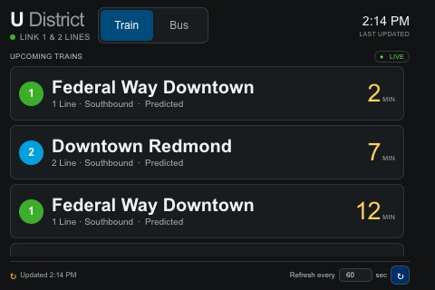

# Sound Transit Train Times

A small, configurable arrivals display for local rail and bus stops. The React frontend is built on a development computer; one Python server handles OneBusAway requests and serves the built app on the Raspberry Pi. The landscape layout targets the Pi's 480 × 320 display and shows a large, scrollable list of upcoming arrivals.

### Raspberry Pi size preview

This preview uses the southbound U District stop and real OneBusAway arrivals. The list contains more rows than fit on screen, so it can be scrolled to view later departures.

## Develop on a computer

1. Put your OneBusAway key in `.env` as `API_KEY=...`.
2. Start the Python API in one terminal with `npm run dev:api` (Python dependencies from `requirements.txt` must be installed).
3. Start the frontend in another terminal with `npm run dev`.

Vite forwards `/api` requests to the Python server, so development and production use the same OneBusAway SDK implementation.

## Private transit configuration

The real `config/transit.json` is ignored by Git because it contains location-specific station and stop information. Create it from `config/transit.example.json`, then replace placeholders such as `<station name>`, `<service label>`, `<bus stop name>`, `<bus route label>`, and the stop ID placeholders with your own values. Keep this private config and `.env` on the development computer and Pi only.

The Python server provides display settings from this private config to the frontend. The JSON structure is validated when the server starts. Add modes with stop IDs, then add matching frontend presentation if the new mode needs different treatment.

## Run the production build

1. Run `npm run build` on the development computer.
2. Make sure the Pi has Python 3.7 or later and a `.env` file containing `API_KEY=...`.
3. Copy this folder's `dist/`, `server.py`, `requirements.txt`, and your private `config/transit.json` to the Pi. The deploy script includes the private config automatically.
4. Install the server dependency with `python3 -m pip install --user -r requirements.txt`.
5. From that folder on the Pi, run `python3 server.py`.
6. Open `http://localhost:4173` in Chromium.

For Raspberry Pi OS (Legacy) with the LXDE desktop, `pi/lxsession-autostart` preserves the stock panel and desktop entries, disables screen blanking via `pi/disable-screen-blanking.sh`, and starts the server and kiosk browser after desktop login. The deploy script installs these automatically. For manual setup, copy the autostart file to `/home/pi/.config/lxsession/LXDE-pi/autostart` and copy `pi/start-kiosk.sh` plus `pi/disable-screen-blanking.sh` to `/home/pi/sound-transit-display/`, then make both scripts executable. This setup starts after desktop login; enable desktop auto-login in Raspberry Pi Configuration if it is not already enabled. The kiosk launcher adds `?kiosk=1` to hide the pointer over the app.

The Pi does not need Node.js or npm to serve the production app. The OneBusAway Python SDK is pinned to version 1.2.4, which supports the Pi's current Python 3.7 runtime. The API key is read from `.env` and stop IDs from the private transit config; neither is sent to the browser. Display settings are returned by the server's config endpoint.

## Deploy to the Raspberry Pi

Run `./pi/deploy.sh` from this project folder. The script builds the frontend, looks for `raspberrypi.local` or a Raspberry Pi address in the local ARP table, uses `PI_PASSWORD` from the local `.env` for non-interactive SSH, installs the Python SDK, copies the app without replacing the Pi's `.env`, updates desktop auto-start, and restarts the server and kiosk. The Pi and computer need to be on the same network, and SSH must be enabled on the Pi. Add `PI_PASSWORD=your_pi_ssh_password` to your local `.env`; do not commit `.env`.

If discovery cannot find it, enter the Pi's hostname or IP when prompted. You can also set `PI_HOST`, `PI_USER`, or `PI_DIR` before running the script, for example `PI_HOST=192.168.0.49 ./pi/deploy.sh`. The defaults are user `pi` and `/home/pi/sound-transit-display`.
